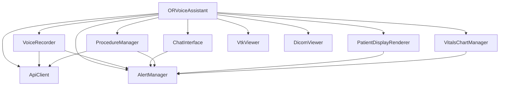

# 🔧 JavaScript Refactoring Guide

## Overview

The main.js file has been completely refactored from a monolithic 1645-line file into a modular, maintainable architecture with focused, single-responsibility components.

## 📁 New File Structure

```
frontend/js/
├── main-refactored.js          # New lightweight orchestrator (replaces main.js)
├── api-client.js               # Centralized API communication
├── alert-manager.js            # User notifications and alerts
├── voice-recorder.js           # Audio recording and transcription
├── chat-interface.js           # Chat history and messaging
├── procedure-manager.js        # Procedure switching and data management
├── patient-display-renderer.js # Patient information rendering
├── vitals-chart-manager.js     # Chart visualization and real-time data
└── REFACTORING-GUIDE.md        # This documentation
```

## 🎯 Component Responsibilities

### **ApiClient** (`api-client.js`)
- **Purpose**: Centralized backend communication
- **Responsibilities**:
  - Audio transcription requests
  - Command processing
  - Procedure data loading
  - Mock data fallback
  - Generic GET/POST operations
- **Dependencies**: None
- **Used by**: All components that need API access

### **AlertManager** (`alert-manager.js`)
- **Purpose**: User notifications and alert system
- **Responsibilities**:
  - Show/hide alerts with different severity levels
  - Queue alerts when max limit reached
  - Auto-dismiss with configurable timeouts
  - Click-to-dismiss functionality
  - Alert positioning and animations
- **Dependencies**: None
- **Used by**: All components for user notifications

### **VoiceRecorder** (`voice-recorder.js`)
- **Purpose**: Audio recording and transcription
- **Responsibilities**:
  - Microphone access and recording
  - Audio format handling
  - Transcription via API
  - Recording UI state management
  - Keyboard shortcuts (Ctrl+Space)
- **Dependencies**: ApiClient, AlertManager
- **Used by**: Main orchestrator

### **ChatInterface** (`chat-interface.js`)
- **Purpose**: Chat history and messaging
- **Responsibilities**:
  - Message display and formatting
  - Text input handling
  - Chat history management
  - TTS audio playback
  - Chat export functionality
- **Dependencies**: AlertManager
- **Used by**: Main orchestrator

### **ProcedureManager** (`procedure-manager.js`)
- **Purpose**: Procedure switching and data management
- **Responsibilities**:
  - Procedure button handling
  - Data loading for procedures
  - Fallback data management
  - Procedure state tracking
  - Data refresh capabilities
- **Dependencies**: ApiClient, AlertManager
- **Used by**: Main orchestrator

### **PatientDisplayRenderer** (`patient-display-renderer.js`)
- **Purpose**: Patient information UI rendering
- **Responsibilities**:
  - Patient data formatting
  - Collapsible sections creation
  - Medical data visualization
  - Risk scores display
  - Allergy alerts styling
- **Dependencies**: AlertManager
- **Used by**: Main orchestrator

### **VitalsChartManager** (`vitals-chart-manager.js`)
- **Purpose**: Chart visualization and real-time monitoring
- **Responsibilities**:
  - Chart.js management
  - Real-time data updates
  - Status indicators display
  - Chart export functionality
  - Data persistence
- **Dependencies**: Chart.js, AlertManager
- **Used by**: Main orchestrator

### **ORVoiceAssistant** (`main-refactored.js`)
- **Purpose**: Lightweight orchestrator
- **Responsibilities**:
  - Component initialization
  - Component interaction wiring
  - Command processing coordination
  - External viewer integration
  - Application lifecycle management
- **Dependencies**: All other components
- **Used by**: Application entry point

## 🔄 Component Interactions



## 🚀 Benefits of Refactoring

### **1. Single Responsibility Principle**
- Each component has one clear purpose
- Easier to understand and maintain
- Reduces coupling between functionalities

### **2. Improved Testability**
- Components can be tested in isolation
- Easier to mock dependencies
- Better unit test coverage possible

### **3. Better Code Organization**
- Related functionality grouped together
- Easier to locate and modify specific features
- Reduced file size makes navigation easier

### **4. Enhanced Maintainability**
- Bug fixes isolated to specific components
- Feature additions don't affect unrelated code
- Easier onboarding for new developers

### **5. Reusability**
- Components can be reused in other projects
- Modular architecture supports extension
- Easy to swap implementations

## 📝 Usage Examples

### **Creating a New Component**
```javascript
// new-component.js
export class NewComponent {
    constructor(dependencies) {
        this.dependencies = dependencies;
        this.initialize();
    }
    
    initialize() {
        // Setup logic
    }
    
    // Component methods...
}
```

### **Using Components in Main**
```javascript
// In main-refactored.js
import { NewComponent } from './new-component.js';

class ORVoiceAssistant {
    initializeComponents() {
        this.newComponent = new NewComponent({
            apiClient: this.apiClient,
            alertManager: this.alertManager
        });
    }
}
```

### **Component Communication**
```javascript
// Setting up callbacks
this.voiceRecorder.onTranscription((result) => {
    this.chatInterface.addUserMessage(result.transcript, 'Voice');
    this.processCommand(result.transcript);
});
```

## 🔧 Migration Guide

### **Switching to Refactored Version**

1. **Update index.html**:
   ```javascript
   // Change import in index.html
   import('./js/main-refactored.js')
   ```

2. **Backup Original**:
   ```bash
   cp main.js main-original.js
   ```

3. **Replace Main File**:
   ```bash
   cp main-refactored.js main.js
   ```

### **Rollback Plan**
If issues occur, simply restore the original:
```bash
cp main-original.js main.js
```

## 🧪 Testing Strategy

### **Unit Testing**
Each component can be tested independently:
```javascript
// Example test
import { AlertManager } from './alert-manager.js';

test('AlertManager shows alert', () => {
    const alertManager = new AlertManager();
    const alert = alertManager.showAlert('Test', 'info');
    expect(alert).toBeDefined();
});
```

### **Integration Testing**
Test component interactions:
```javascript
test('VoiceRecorder integrates with ApiClient', async () => {
    const mockApiClient = new MockApiClient();
    const voiceRecorder = new VoiceRecorder(mockApiClient);
    // Test interaction...
});
```

## 📊 Performance Improvements

### **Before Refactoring**
- ❌ 1645 lines in single file
- ❌ Multiple responsibilities mixed
- ❌ Difficult to optimize specific features
- ❌ Hard to debug issues

### **After Refactoring**
- ✅ ~150-300 lines per component
- ✅ Clear separation of concerns
- ✅ Targeted performance optimizations
- ✅ Easy to trace issues

## 🛠️ Development Workflow

### **Adding New Features**
1. Identify which component should handle the feature
2. If no suitable component exists, create a new one
3. Update the main orchestrator to integrate the component
4. Add necessary component interactions

### **Bug Fixes**
1. Identify the component responsible for the bug
2. Fix the issue within that component
3. Test the component in isolation
4. Verify integration still works

### **Code Reviews**
- Review each component separately
- Focus on single responsibility adherence
- Check component interfaces and contracts
- Verify proper error handling

## 📚 Best Practices

### **Component Design**
- Keep components focused on single responsibility
- Use dependency injection for external services
- Implement proper error handling
- Document public interfaces

### **Error Handling**
- Each component should handle its own errors gracefully
- Use AlertManager for user notifications
- Log errors appropriately for debugging

### **Event Communication**
- Use callbacks for component communication
- Avoid tight coupling between components
- Consider using event emitters for complex scenarios

## 🔮 Future Enhancements

### **Potential Improvements**
1. **State Management**: Add Redux/Zustand for complex state
2. **Event System**: Implement pub/sub for loose coupling
3. **Module Loading**: Dynamic imports for better performance
4. **Type Safety**: Convert to TypeScript
5. **Testing**: Add comprehensive test suite

### **Scalability Considerations**
- Components are designed to be independently scalable
- Easy to split into separate modules/packages
- Ready for microfrontend architecture if needed

## 📞 Support

If you encounter issues with the refactored code:
1. Check this documentation
2. Review component interfaces
3. Use browser dev tools for debugging
4. Consider reverting to original if critical issues arise

---

**Note**: This refactoring maintains 100% functional compatibility with the original monolithic version while providing a much more maintainable codebase. 